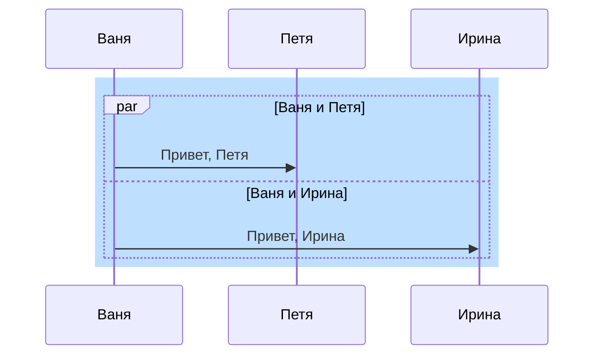

# Used technologies and plugins
## Used technologies
* Python

# DB Tools

- DBeaver Community - Free Universal Database Tool  
https://dbeaver.io

## SQLite DB

- SQLiteStudio  
https://sqlitestudio.pl

- DB Browser for SQLite  
https://sqlitebrowser.org

# Web Tools
## Chrome
- Lighthouse - an open-source, automated tool for improving the performance, quality, and correctness of your web apps  
https://chrome.google.com/webstore/detail/lighthouse/blipmdconlkpinefehnmjammfjpmpbjk?hl=ru

# Common
## MarkDown
- Description  
https://github.com/Buterbrod/Swimming-open/new/main/docs

- Mermaid  
https://mermaid-js.github.io/mermaid/#/

