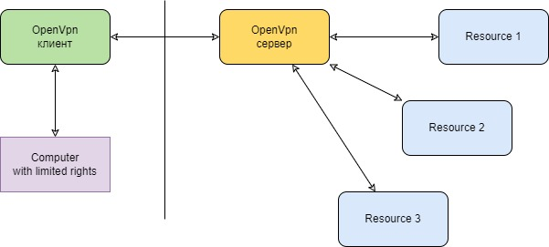

# Задача
Я, как пользователь, находясь вне страны, хочу получить доступ к ресурсам внутри страны.
- соединение должно быть стабильным
- соединение должно поддериваться в произвольном месте (дом, коворкинг)

#### Содержание
[Варианты решений](#варианты-решений)  
[Исходные данные](#исходные-данные)  
[Решение](#решение)  
[Реализация](#реализация)  

# Варианты решений
## Прошивка роутеров
- [OpenWrt](https://openwrt.org)   
  Список поддерживаемого оборудования один из замых больших
- [DD-WRT](https://dd-wrt.com)
- [libreCMC](https://www.librecmc.org)
## Протоколы
- [OpenVPN](https://openvpn.net)
- [WireGuard](https://www.wireguard.com)

# Исходные данные
## Mi Router 4A Gigabit Edition
Dual-Core Full Gigabit AC1200 Router  
https://www.mi.com/ru/product/mi-router-4a-gigabit-edition
- Двухъядерный процессор (4 потока, с тактовой частотой одного ядра до 880 МГц)
- Большой объем памяти (128Гб)
- Один гигабитный порт WAN
- Два гигабитных сетевых порта LAN (10/100/1000 Ethernet)
- 4 всенаправленные антенны с мощным усилением
- 1167 Мбит/с - максимальная скорость беспроводного сигнала при одновременной работе в двух диапазонах (2,4 ГГц и 5 ГГц)
- Два параллельных диапазона - 2,4 и 5 ГГц
  - Полоса пропускания 2,4 ГГц обеспечивает передачу сигнала на большие расстояния для увеличения зоны покрытия и эффективного подключения через стены
  - Полоса 5 ГГц использует протокол 802.11ac для снижения помех и повышения скорости подключения
  - Двухдиапазонная интеграция с одним SSID
  - Обе микросхемы беспроводной связи — как 2,4 ГГц, так и 5 ГГц — оборудованы встроенным усилителем мощности и модулем шумоподавления
  - Сеть 5 ГГц поддерживает код с низкой плотностью проверок на четкость (LDPC) для коррекции ошибок

# Решение
  
Поднять VPN на роутере (и компьютере)  
Поддержать фиксированный IP адрес  
Добавить уведомления при несанкционированном доступе к сети  
Добавить блокирование несанкционированного доступа  
Убедиться в стабильности решения  

# Реализация
## Установка OpenWRT
Проект OpenWrt - это операционная система GNU/Linux, предназначенная для встраиваемых устройств.  
Вместо того, чтобы пытаться создать единую статическую прошивку, OpenWrt предоставляет полностью доступную для записи файловую систему с управлением пакетами. Это освобождает вас от выбора и настройки приложений, предоставляемых поставщиком, и позволяет настраивать устройство с помощью пакетов, подходящих для любого приложения.

Сайт:
- https://openwrt.org

Предостережения:
- Не торопитесь с установкой, не торопитесь.
- Если во время установки что-то кажется странным, сначала найдите ответы, прежде чем продолжить.
- Имейте под рукой точное название модели вашего устройства, чтобы вы могли выбрать правильную прошивку OpenWrt.
- Держите под рукой документацию вашего устройства, как прошить новую прошивку.
- При установке и настройке OpenWrt на вашем интернет-маршрутизаторе ваш интернет-доступ, очевидно, будет отключен на несколько минут. Убедитесь, что в это время у вас есть вся необходимая информация в автономном режиме или резервный доступ в Интернет.

Шаги:
1. Шаги установки указаны на сайте OpenWRT:
   - https://openwrt.org/docs/guide-quick-start/start
2. Скачиваем прошивку для нашего роутера  
   На 30.07.2022 [stable “Release” build](https://openwrt.org/releases/start) - это версия OpenWrt 21.02.3
   1. Переходим на страницу выбора прошивки для роутера
      - https://openwrt.org/toh/start
   2. Выбираем наше устройство: "Xiaomi Mi Router 4A (MIR4A) Gigabit Edition"
      Прошивки:
      - → Firmware OpenWrt Install URL: GUI / LuCI pre-installed
      - Firmware OpenWrt Upgrade URL: GUI / LuCI pre-installed
      - Firmware OpenWrt snapshot Install URL: No GUI / LuCI pre-installed
      - Firmware OpenWrt snapshot Upgrade URL: No GUI / LuCI pre-installed   
   3. Скачиваем "Firmware OpenWrt Install URL" для "Xiaomi Mi Router 4A (MIR4A) Gigabit Edition"
      - https://downloads.openwrt.org/releases/21.02.3/targets/ramips/mt7621/openwrt-21.02.3-ramips-mt7621-xiaomi_mi-router-4a-gigabit-squashfs-sysupgrade.bin
3. Установка OpenWRT  
   В этом разделе описаны действия, которые могут повредить ваше устройство или прошивку. Действуйте осторожно!
   1. Общие инструкции
      - [Общая инструкция](https://openwrt.org/docs/guide-user/installation/generic.flashing)
      - [Выбор инструкции для конкретного устройства](https://openwrt.org/toh/start)
   2. Инструкции для Xiaomi Mi Router 4A (MIR4A) Gbit
      - [Инструкция для Xiaomi Mi Router 4A (MIR4A) Gbit](https://openwrt.org/inbox/toh/xiaomi/xiaomi_mi_router_4a_gigabit_edition)
      - [Видео установки OpenWrt на Xiaomi 4A, 4C, 3Gv2, 4Q, miWifi 3C и метод debrick](https://www.youtube.com/watch?v=VxzEvdDWU_s)
      - [Техническая информация по Xiaomi Mi Router 4A (MIR4A) Gbit](https://openwrt.org/toh/hwdata/xiaomi/xiaomi_mi_router_4a_gbit)
   3. Скачиваем дистрибутив [OpenWRTInvasion](https://github.com/acecilia/OpenWRTInvasion) с GitHub
      - скачиваем zip
      - или "git clone https://github.com/acecilia/OpenWRTInvasion.git"
      - OpenWRTInvasion требуется для получение telnet доступа - она устанавливает и поднимает telnet-сервер на роутере
        логинпасс: root/root
   4. Устанавливаем Python (если не установлен)
      - https://www.python.org
   5. Скачиваем клиенты
      - telnet  
        https://putty.org.ru
      - cyberduck (ftp-клиент)
        https://cyberduck.io/download
   5. Переходим в директорию OpenWRTInvasion
      - устанавливаем последнюю версию pip  
        >python -m pip install --upgrade pip
      - устанавливаем все требуемые библиотеки
        pip3 install -r .\OpenWRTInvasion-master\requirements.txt
   6. Переходим на страницу роутера и входим в конфигурацию
      - 192.168.31.1
   7. Берём значение идентификатора stok для роутера
      - адрес в браузере:  
        http://192.168.31.1/cgi-bin/luci/;stok=668c6995379ba26315c4a6487c4ce2cb/web/home#router
      - stok = 668c6995379ba26315c4a6487c4ce2cb
               fe7d80178427f04014a9fdf672e107c4
      - !!! stok меняется при каждой перезагрузке роутера
   8. Переходим в директорию OpenWRTInvasion-master
      - >cd OpenWRTInvasion-master
   9. Запускаем remote_command_execution_vulnerability.py 
      - >python remote_command_execution_vulnerability.py
      - при запросе IP адреса вводим IP адрес роутера:  
        Router IP address: 192.168.31.1
      - при запросе пароля к роутеру вводим его
      - если вдруг попросят stok - вводим его:  
        stok: <______________>
   10. Если перепрошито без проблем, то видим
       - ```
         Router IP address [press enter for using the default 'miwifi.com']: 192.168.31.1 
         Enter router admin password: <пароль от роутера>
         There two options to provide the files needed for invasion:
         1. Use a local TCP file server runing on random port to provide files in local directory `script_tools`.
         2. Download needed files from remote github repository. (choose this option only if github is accessable inside router device.)
         Which option do you prefer? (default: 1)
         ****************
         router_ip_address: 192.168.31.1
         stok: df34e13be87442d2eb6d097ddd2a4038
         file provider: local file server
         ****************
         start uploading config file...
         start exec command...
         local file server is runing on 0.0.0.0:57488. root='script_tools'
         local file server is getting 'busybox-mipsel' for 192.168.31.1.
         local file server is getting 'dropbearStaticMipsel.tar.bz2' for 192.168.31.1.
         done! Now you can connect to the router using several options: (user: root, password: root)
         * telnet 192.168.31.1
         * ssh -oKexAlgorithms=+diffie-hellman-group1-sha1 -c 3des-cbc -o UserKnownHostsFile=/dev/null root@192.168.31.1
         * ftp: using a program like cyberduck
         ```
   11. Заходим на роутер через терминал telnet
       - >telnet 192.168.31.1
       - username: root/root
       - ! Если будут проблемы про входе, то ппц и надо смотреть видео  
         https://youtu.be/VxzEvdDWU_s?t=149
   12. Через ftp (приложение Cyberduck) заходим на роутер и в директорию \tmp кладём скачанный образ OpenWrt
       - >наименование образа меняем на openwrt.bin
       - ftp 192.168.31.1 (root/root)
       - cd tmp
       - put path/to/openwrt.bin
   13. Заходим по telnet-сессии и перепрошиваем роутер
       - telnet 192.168.31.1
       - cd /tmp
       - mtd -e OS1 -r write openwrt.bin OS1
       - ```
         Unlocking OSI ...
         Erasing OSI ...
         
         Writing from openwrt.bin to OSI ...
         Rebooting ...
         ```
   14. Заходим через браузер на прошивку OpenWRT по адресу 192.168.1.1
       - login: root/root
   15. Всё, вы в оболочке LUCI
   16. Если что-то пошло не так, то надо делать Debrick  
       https://youtu.be/VxzEvdDWU_s?t=266  
       https://www.linux.org.ru/forum/admin/12346954
   17. Меняем пароль
       - Меню: System -> Administration
       - Router Password
4. Настраиваем статический IP
   1. В qwerty статический IP даётся по сетевому имени (host name)  
      Для одного компьютера с постоянным IP - сетевое имя должно быть QWERTY1, для второго - QWERTY2, и так далее
   2. Заходим на роутер (LuCI)
      - меню: System -> System
      - Hostname: QWERTY1
   3. Делаем перезагрузку роутера
      - меню: System -> Reboot
   4. Проверяем адрес извне - должен совпадать с выданным
      - https://2ip.ru/privacy
      - https://yandex.ru/internet
4. Ставим OpenVPN сервер на OpenWrt
   1. Документация
      - [OpenVPN server](https://openwrt.org/docs/guide-user/services/vpn/openvpn/server)
   2. Скачиваем пакеты OpenWrt
      - [openvpn-openssl](https://openwrt.org/packages/pkgdata/openvpn-openssl)
      - [openvpn-easy-rsa](https://openwrt.org/packages/pkgdata/openvpn-easy-rsa)